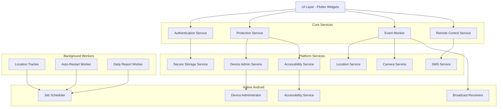

1# Design Document - Anti-Theft Protection App

## Overview

تطبيق حماية من السرقة متقدم لنظام Android مصمم للاستخدام الشخصي يوفر حماية متعددة الطبقات ضد السرقة والوصول غير المصرح به. التطبيق يستخدم مجموعة من تقنيات Android المتقدمة بما في ذلك Device Administration API، Accessibility Service، وTask Locking لتوفير حماية شاملة.

### Core Philosophy

التصميم يعتمد على مبدأ "Defense in Depth" - طبقات حماية متعددة بحيث إذا تم تجاوز طبقة، تبقى الطبقات الأخرى فعالة. التطبيق مصمم ليكون persistent ومقاوم للتعطيل، مع التركيز على:

1. **Persistence** - التطبيق يعيد تشغيل نفسه تلقائياً ويقاوم محاولات الإيقاف
2. **Stealth** - القدرة على العمل بشكل خفي لتجنب اكتشاف اللص
3. **Evidence Collection** - جمع أدلة (صور، مواقع، سجلات) لمساعدة في استرجاع الجهاز
4. **Remote Control** - التحكم الكامل عن بعد عبر SMS
5. **User Experience** - واجهة بسيطة وواضحة للمستخدم الشرعي

### Target Platform

- **Platform**: Android 8.0 (API 26) وأعلى
- **Language**: Dart/Flutter
- **Key Dependencies**: 
  - device_admin (للتحكم في الجهاز)
  - geolocator (لتتبع الموقع)
  - camera (للتصوير)
  - telephony (للـ SMS)
  - shared_preferences (للتخزين المحلي)
  - flutter_secure_storage (للتخزين المشفر)
  - workmanager (للمهام في الخلفية)

## Architecture

### High-Level Architecture

التطبيق يتبع Clean Architecture مع فصل واضح بين الطبقات:

```
┌─────────────────────────────────────────────────────────┐
│                    Presentation Layer                    │
│  (UI Screens, Widgets, State Management - Provider)     │
└────────────────────┬────────────────────────────────────┘
                     │
┌────────────────────▼────────────────────────────────────┐
│                   Application Layer                      │
│     (Use Cases, Business Logic, State Management)       │
└────────────────────┬────────────────────────────────────┘
                     │
┌────────────────────▼────────────────────────────────────┐
│                    Domain Layer                          │
│        (Entities, Repository Interfaces)                 │
└────────────────────┬────────────────────────────────────┘
                     │
┌────────────────────▼────────────────────────────────────┐
│                Infrastructure Layer                      │
│  (Platform Services, Storage, Sensors, Native Code)     │
└─────────────────────────────────────────────────────────┘
```

### System Components Diagram



## Components and Interfaces

### 1. Authentication Service

**Purpose**: إدارة المصادقة وكلمات المرور

**Interface**:
```dart
abstract class IAuthenticationService {
  /// Initialize master password on first run
  Future<bool> setupMasterPassword(String password);
  
  /// Verify master password
  Future<bool> verifyPassword(String password);
  
  /// Check if password is set
  Future<bool> isPasswordSet();
  
  /// Change master password
  Future<bool> changeMasterPassword(String oldPassword, String newPassword);
  
  /// Record failed attempt
  Future<void> recordFailedAttempt();
  
  /// Get failed attempts count
  Future<int> getFailedAttemptsCount();
  
  /// Reset failed attempts counter
  Future<void> resetFailedAttempts();
  
  /// Check if account is locked due to too many attempts
  Future<bool> isLocked();
}
```

**Implementation Details**:
- Password hashing: SHA-256 with random salt
- Salt stored separately in secure storage
- Failed attempts counter with timestamp
- Automatic lockout after 3 failed attempts
- Photo capture trigger on 3rd failed attempt

### 2. Protection Service

**Purpose**: إدارة وضع الحماية وجميع ميزات الأمان

**Interface**:
```dart
abstract class IProtectionService {
  /// Enable protected mode
  Future<bool> enableProtectedMode();
  
  /// Disable protected mode (requires password)
  Future<bool> disableProtectedMode(String password);
  
  /// Check if protected mode is active
  Future<bool> isProtectedModeActive();
  
  /// Enable kiosk mode
  Future<bool> enableKioskMode();
  
  /// Disable kiosk mode (requires password)
  Future<bool> disableKioskMode(String password);
  
  /// Check if kiosk mode is active
  Future<bool> isKioskModeActive();
  
  /// Enable panic mode
  Future<void> enablePanicMode();
  
  /// Disable panic mode (requires password twice)
  Future<bool> disablePanicMode(String password);
  
  /// Enable stealth mode
  Future<void> enableStealthMode();
  
  /// Disable stealth mode
  Future<void> disableStealthMode();
  
  /// Check if stealth mode is active
  Future<bool> isStealthModeActive();
}
```

**Implementation Details**:
- State persistence in encrypted storage
- Integration with Device Administrator
- Integration with Accessibility Service for UI blocking
- Task locking for kiosk mode
- Foreground service for persistence

### 3. Monitoring Service

**Purpose**: مراقبة الأحداث والأنشطة المشبوهة

**Interface**:
```dart
abstract class IMonitoringService {
  /// Start monitoring all events
  Future<void> startMonitoring();
  
  /// Stop monitoring
  Future<void> stopMonitoring();
  
  /// Monitor airplane mode changes
  Stream<AirplaneModeEvent> monitorAirplaneMode();
  
  /// Monitor SIM card changes
  Stream<SimChangeEvent> monitorSimCard();
  
  /// Monitor app launches
  Stream<AppLaunchEvent> monitorAppLaunches();
  
  /// Monitor screen unlock attempts
  Stream<UnlockAttemptEvent> monitorUnlockAttempts();
  
  /// Monitor power button events
  Stream<PowerButtonEvent> monitorPowerButton();
  
  /// Monitor boot mode (safe mode detection)
  Future<BootMode> detectBootMode();
  
  /// Monitor call events
  Stream<CallEvent> monitorCalls();
  
  /// Monitor USB debugging status
  Stream<UsbDebuggingEvent> monitorUsbDebugging();
}
```

**Implementation Details**:
- Broadcast receivers for system events
- Accessibility service for UI events
- Content observers for settings changes
- Phone state listener for calls
- Continuous background monitoring via WorkManager

### 4. Location Service

**Purpose**: تتبع موقع الجهاز

**Interface**:
```dart
abstract class ILocationService {
  /// Start location tracking
  Future<void> startTracking({Duration interval = const Duration(minutes: 5)});
  
  /// Stop location tracking
  Future<void> stopTracking();
  
  /// Get current location
  Future<LocationData> getCurrentLocation();
  
  /// Get location history
  Future<List<LocationData>> getLocationHistory({DateTime? since});
  
  /// Enable high-frequency tracking (panic mode)
  Future<void> enableHighFrequencyTracking();
  
  /// Disable high-frequency tracking
  Future<void> disableHighFrequencyTracking();
}
```

**Implementation Details**:
- FusedLocationProvider for battery efficiency
- Periodic location updates via WorkManager
- Location history stored in encrypted database
- High-frequency mode (30 seconds) for panic situations
- Fallback to network location if GPS unavailable

### 5. Camera Service

**Purpose**: التقاط صور من الكاميرا الأمامية

**Interface**:
```dart
abstract class ICameraService {
  /// Capture photo from front camera silently
  Future<CapturedPhoto> captureFrontPhoto();
  
  /// Capture photo from back camera
  Future<CapturedPhoto> captureBackPhoto();
  
  /// Get captured photos
  Future<List<CapturedPhoto>> getCapturedPhotos();
  
  /// Delete captured photo
  Future<void> deletePhoto(String photoId);
}
```

**Implementation Details**:
- Silent capture without preview or shutter sound
- Photos stored in app private directory
- Encrypted storage for photos
- Metadata includes timestamp and location
- Automatic cleanup of old photos (30 days)

### 6. SMS Service

**Purpose**: إرسال واستقبال رسائل SMS للتحكم عن بعد

**Interface**:
```dart
abstract class ISmsService {
  /// Send SMS to emergency contact
  Future<bool> sendSms(String phoneNumber, String message);
  
  /// Register SMS receiver for remote commands
  void registerSmsReceiver();
  
  /// Unregister SMS receiver
  void unregisterSmsReceiver();
  
  /// Parse and execute remote command
  Future<void> handleRemoteCommand(String sender, String message);
  
  /// Send location via SMS
  Future<void> sendLocationSms(String phoneNumber, LocationData location);
  
  /// Send daily status report
  Future<void> sendDailyReport(String phoneNumber);
}
```

**Implementation Details**:
- SMS broadcast receiver for incoming messages
- Command parsing with format validation
- Password verification for commands
- Emergency contact whitelist
- SMS sending with delivery confirmation

### 7. Security Log Service

**Purpose**: تسجيل جميع الأحداث الأمنية

**Interface**:
```dart
abstract class ISecurityLogService {
  /// Log security event
  Future<void> logEvent(SecurityEvent event);
  
  /// Get all security events
  Future<List<SecurityEvent>> getAllEvents();
  
  /// Get events by type
  Future<List<SecurityEvent>> getEventsByType(SecurityEventType type);
  
  /// Get events in date range
  Future<List<SecurityEvent>> getEventsByDateRange(DateTime start, DateTime end);
  
  /// Clear all logs (requires password)
  Future<void> clearLogs(String password);
  
  /// Export logs as encrypted file
  Future<File> exportLogs(String password);
}
```

**Implementation Details**:
- SQLite database for log storage
- Encrypted database using sqlcipher
- Event types: failed_login, camera_capture, location_update, sim_change, etc.
- Automatic log rotation (keep last 1000 events)
- Export to encrypted JSON file

### 8. Device Admin Service

**Purpose**: التفاعل مع Device Administration API

**Interface**:
```dart
abstract class IDeviceAdminService {
  /// Check if device admin is active
  Future<bool> isAdminActive();
  
  /// Request device admin activation
  Future<bool> requestAdminActivation();
  
  /// Lock device screen
  Future<void> lockDevice();
  
  /// Wipe device data (factory reset)
  Future<void> wipeDevice();
  
  /// Set password quality requirements
  Future<void> setPasswordQuality(PasswordQuality quality);
  
  /// Disable camera (system-wide)
  Future<void> disableCamera(bool disable);
}
```

**Implementation Details**:
- Native Android Device Administrator implementation
- Method channel for Flutter-Android communication
- Admin receiver for intercepting deactivation attempts
- Password prompt overlay on deactivation

### 9. Accessibility Service

**Purpose**: مراقبة والتفاعل مع واجهة المستخدم

**Interface**:
```dart
abstract class IAccessibilityService {
  /// Check if accessibility service is enabled
  Future<bool> isServiceEnabled();
  
  /// Request accessibility service activation
  Future<void> requestServiceActivation();
  
  /// Block app launch
  Future<void> blockAppLaunch(String packageName);
  
  /// Show password overlay
  Future<void> showPasswordOverlay();
  
  /// Detect power menu
  Future<bool> isPowerMenuVisible();
  
  /// Block power menu
  Future<void> blockPowerMenu();
}
```

**Implementation Details**:
- Native Android Accessibility Service
- Event interception for app launches
- Window overlay for password prompts
- Power button event detection
- Settings app detection and blocking

### 10. Storage Service

**Purpose**: تخزين آمن للبيانات الحساسة

**Interface**:
```dart
abstract class IStorageService {
  /// Store encrypted value
  Future<void> storeSecure(String key, String value);
  
  /// Retrieve encrypted value
  Future<String?> retrieveSecure(String key);
  
  /// Delete encrypted value
  Future<void> deleteSecure(String key);
  
  /// Store non-sensitive value
  Future<void> store(String key, dynamic value);
  
  /// Retrieve non-sensitive value
  Future<dynamic> retrieve(String key);
  
  /// Clear all storage
  Future<void> clearAll();
}
```

**Implementation Details**:
- flutter_secure_storage for sensitive data
- shared_preferences for non-sensitive data
- AES encryption for additional security
- Key-value storage model

## Data Models

### SecurityEvent

```dart
class SecurityEvent {
  final String id;
  final SecurityEventType type;
  final DateTime timestamp;
  final String description;
  final Map<String, dynamic> metadata;
  final LocationData? location;
  final String? photoPath;
  
  SecurityEvent({
    required this.id,
    required this.type,
    required this.timestamp,
    required this.description,
    required this.metadata,
    this.location,
    this.photoPath,
  });
  
  Map<String, dynamic> toJson();
  factory SecurityEvent.fromJson(Map<String, dynamic> json);
}

enum SecurityEventType {
  failedLogin,
  successfulLogin,
  protectedModeEnabled,
  protectedModeDisabled,
  kioskModeEnabled,
  kioskModeDisabled,
  panicModeActivated,
  airplaneModeChanged,
  simCardChanged,
  settingsAccessed,
  powerMenuBlocked,
  appForceStop,
  remoteCommandReceived,
  remoteCommandExecuted,
  locationTracked,
  photoCapture,
  callLogged,
  safeModeDetected,
  usbDebuggingEnabled,
  fileManagerAccessed,
}
```

### LocationData

```dart
class LocationData {
  final double latitude;
  final double longitude;
  final double accuracy;
  final DateTime timestamp;
  final String? address;
  
  LocationData({
    required this.latitude,
    required this.longitude,
    required this.accuracy,
    required this.timestamp,
    this.address,
  });
  
  String toGoogleMapsLink() {
    return 'https://maps.google.com/?q=$latitude,$longitude';
  }
  
  Map<String, dynamic> toJson();
  factory LocationData.fromJson(Map<String, dynamic> json);
}
```

### CapturedPhoto

```dart
class CapturedPhoto {
  final String id;
  final String filePath;
  final DateTime timestamp;
  final LocationData? location;
  final String reason; // e.g., "failed_login", "sim_change"
  
  CapturedPhoto({
    required this.id,
    required this.filePath,
    required this.timestamp,
    this.location,
    required this.reason,
  });
  
  Map<String, dynamic> toJson();
  factory CapturedPhoto.fromJson(Map<String, dynamic> json);
}
```

### ProtectionConfig

```dart
class ProtectionConfig {
  final bool protectedModeEnabled;
  final bool kioskModeEnabled;
  final bool stealthModeEnabled;
  final bool panicModeEnabled;
  final String? emergencyContact;
  final Duration locationTrackingInterval;
  final bool autoProtectionEnabled;
  final List<TimeRange>? autoProtectionSchedule;
  final String? trustedWifiSsid;
  final bool monitorCalls;
  final bool monitorAirplaneMode;
  final bool monitorSimCard;
  final bool blockSettings;
  final bool blockPowerMenu;
  final bool blockFileManagers;
  final bool dailyReportEnabled;
  final TimeOfDay? dailyReportTime;
  
  ProtectionConfig({
    this.protectedModeEnabled = false,
    this.kioskModeEnabled = false,
    this.stealthModeEnabled = false,
    this.panicModeEnabled = false,
    this.emergencyContact,
    this.locationTrackingInterval = const Duration(minutes: 5),
    this.autoProtectionEnabled = false,
    this.autoProtectionSchedule,
    this.trustedWifiSsid,
    this.monitorCalls = true,
    this.monitorAirplaneMode = true,
    this.monitorSimCard = true,
    this.blockSettings = true,
    this.blockPowerMenu = true,
    this.blockFileManagers = true,
    this.dailyReportEnabled = false,
    this.dailyReportTime,
  });
  
  Map<String, dynamic> toJson();
  factory ProtectionConfig.fromJson(Map<String, dynamic> json);
}
```

### RemoteCommand

```dart
class RemoteCommand {
  final RemoteCommandType type;
  final String password;
  final String sender;
  final DateTime receivedAt;
  final Map<String, dynamic>? parameters;
  
  RemoteCommand({
    required this.type,
    required this.password,
    required this.sender,
    required this.receivedAt,
    this.parameters,
  });
  
  factory RemoteCommand.parse(String sender, String message);
  bool isValid(String masterPasswordHash, String emergencyContact);
}

enum RemoteCommandType {
  lock,    // LOCK#password
  wipe,    // WIPE#password
  locate,  // LOCATE#password
  alarm,   // ALARM#password
}
```

### SimInfo

```dart
class SimInfo {
  final String? iccid;  // SIM card serial number
  final String? imsi;   // International Mobile Subscriber Identity
  final String? phoneNumber;
  final String? carrierName;
  final DateTime recordedAt;
  
  SimInfo({
    this.iccid,
    this.imsi,
    this.phoneNumber,
    this.carrierName,
    required this.recordedAt,
  });
  
  bool isDifferentFrom(SimInfo other) {
    return iccid != other.iccid || imsi != other.imsi;
  }
  
  Map<String, dynamic> toJson();
  factory SimInfo.fromJson(Map<String, dynamic> json);
}
```

### CallLogEntry

```dart
class CallLogEntry {
  final String id;
  final String phoneNumber;
  final CallType type;
  final DateTime timestamp;
  final Duration duration;
  final bool isEmergencyContact;
  
  CallLogEntry({
    required this.id,
    required this.phoneNumber,
    required this.type,
    required this.timestamp,
    required this.duration,
    this.isEmergencyContact = false,
  });
  
  Map<String, dynamic> toJson();
  factory CallLogEntry.fromJson(Map<String, dynamic> json);
}

enum CallType {
  incoming,
  outgoing,
  missed,
}
```


## Correctness Properties

*A property is a characteristic or behavior that should hold true across all valid executions of a system-essentially, a formal statement about what the system should do. Properties serve as the bridge between human-readable specifications and machine-verifiable correctness guarantees.*

### Property 1: Password Hashing Consistency

*For any* valid password string, when stored in the system, the password SHALL be hashed using SHA-256 with a unique salt, and the same password SHALL always produce a verifiable hash that can authenticate the user.

**Validates: Requirements 1.2**

### Property 2: Failed Attempt Counter Reset

*For any* number of failed password attempts, when a correct password is successfully entered, the failed attempt counter SHALL be reset to zero.

**Validates: Requirements 1.6**

### Property 3: Protected Mode Password Requirement

*For any* configuration change or app exit attempt when Protected Mode is active, the system SHALL require Master Password authentication before allowing the action.

**Validates: Requirements 1.4**

### Property 4: Failed Login Logging

*For any* incorrect Master Password entry, the system SHALL log the attempt with timestamp and current location data.

**Validates: Requirements 4.1**

### Property 5: Unauthorized Access Event Recording

*For any* detected unauthorized access event, the system SHALL record the event in encrypted secure log storage with complete metadata.

**Validates: Requirements 4.3**

### Property 6: Photo Capture with Metadata

*For any* captured photo (front or back camera), the system SHALL store it securely with associated metadata including timestamp, location, and reason for capture.

**Validates: Requirements 4.5**

### Property 7: Location Storage with Timestamp

*For any* device location change detected by the tracking service, the system SHALL store the new location with accurate timestamp in the location history.

**Validates: Requirements 5.3**

### Property 8: Airplane Mode Event Logging

*For any* Airplane Mode toggle detected by the monitoring service, the system SHALL log the event and trigger a security alert.

**Validates: Requirements 6.3**

### Property 9: Unauthorized Access Alarm Trigger

*For any* unauthorized access attempt detected, the system SHALL trigger a loud alarm sound at maximum volume.

**Validates: Requirements 7.1**

### Property 10: Suspicious Activity Notification

*For any* suspicious activity detected by monitoring services, the system SHALL send a notification with complete event details.

**Validates: Requirements 7.3**

### Property 11: SMS Command Parsing and Execution

*For any* SMS message received with valid command format (LOCK#password, LOCATE#password, etc.) from the Emergency Contact, the system SHALL parse the command correctly, verify the password, and execute the appropriate action.

**Validates: Requirements 8.1**

### Property 12: Location Response Format

*For any* LOCATE command received with correct password from Emergency Contact, the system SHALL reply with an SMS containing GPS coordinates, accuracy, timestamp, and a valid Google Maps link.

**Validates: Requirements 8.4**

### Property 13: Non-Emergency Contact Command Rejection

*For any* Remote Command received from a phone number that is not the Emergency Contact, the system SHALL ignore the command and log it as suspicious activity.

**Validates: Requirements 8.6**

### Property 14: Incorrect Password Command Failure

*For any* Remote Command received with incorrect password, the system SHALL not execute the command and SHALL send an SMS reply indicating authentication failure.

**Validates: Requirements 8.7**

### Property 15: Setting Change Password Requirement

*For any* setting change attempt in the application, the system SHALL require Master Password confirmation before applying the change.

**Validates: Requirements 9.3**

### Property 16: Power Menu Block Logging

*For any* power menu block event when Protected Mode is active, the system SHALL log the attempt with timestamp and current location.

**Validates: Requirements 11.5**

### Property 17: Unauthorized Settings Access Logging

*For any* unauthorized Settings app access attempt, the system SHALL log the event and capture a front camera photo.

**Validates: Requirements 12.5**

### Property 18: SIM Change SMS Alert

*For any* SIM card change detected, the system SHALL send an SMS to the predefined Emergency Contact number with new SIM details including ICCID and IMSI.

**Validates: Requirements 13.3**

### Property 19: New SIM Photo Capture

*For any* new SIM card insertion detected, the system SHALL capture a front camera photo and store it with the SIM change event metadata.

**Validates: Requirements 13.5**

### Property 20: Backup File Encryption

*For any* backup file created by the export function, the file SHALL be encrypted using the Master Password as the encryption key.

**Validates: Requirements 15.2**

### Property 21: Backup-Restore Round Trip

*For any* valid configuration state, performing a backup followed by a restore SHALL preserve all settings and security logs without data loss.

**Validates: Requirements 15.4**

### Property 22: Emergency Contact Validation and Storage

*For any* phone number entered as Emergency Contact, the system SHALL validate the phone number format and store it in encrypted form.

**Validates: Requirements 16.2**

### Property 23: Failed Unlock Attempt Logging

*For any* failed device screen unlock attempt detected, the system SHALL store the attempt in the Security Log with timestamp.

**Validates: Requirements 17.3**

### Property 24: Call Event Logging

*For any* call made or received when Protected Mode is active, the system SHALL log the phone number, duration, timestamp, and call type.

**Validates: Requirements 19.2**

### Property 25: Call Log Encryption

*For any* call log entry created, the system SHALL store it in the encrypted Security Log database.

**Validates: Requirements 19.3**

### Property 26: Unauthorized File Manager Access Logging

*For any* unauthorized file manager app access attempt, the system SHALL log the event and capture a front camera photo.

**Validates: Requirements 23.5**

### Property 27: Status Report Completeness

*For any* daily status report generated, the report SHALL include Protected Mode status, battery level, last known location, and count of security events.

**Validates: Requirements 25.2**

## Error Handling

### Error Categories

The application handles errors in the following categories:

#### 1. Permission Errors
- **Location Permission Denied**: Gracefully degrade to network-based location or disable tracking with user notification
- **Camera Permission Denied**: Log the denial and notify user that photo capture is disabled
- **SMS Permission Denied**: Disable remote command functionality and alert user
- **Device Admin Not Granted**: Repeatedly prompt user until granted, as it's critical for core functionality
- **Accessibility Service Not Enabled**: Show persistent notification with instructions to enable

#### 2. Hardware Errors
- **Camera Unavailable**: Log error and retry up to 3 times with exponential backoff
- **GPS Unavailable**: Fall back to network location provider
- **No SIM Card**: Disable SIM monitoring but continue other protection features
- **Low Storage**: Implement automatic cleanup of old photos and logs

#### 3. Network Errors
- **SMS Send Failure**: Queue SMS for retry up to 5 times with exponential backoff
- **No Network Connection**: Queue location updates and sync when connection restored

#### 4. Authentication Errors
- **Incorrect Password**: Increment failed attempt counter and trigger appropriate security measures
- **Corrupted Password Hash**: Force password reset with security questions or emergency recovery
- **Locked Account**: Require waiting period or emergency contact verification

#### 5. Data Errors
- **Corrupted Database**: Attempt recovery from backup, if fails, reinitialize with user consent
- **Encryption/Decryption Failure**: Log error and alert user, may require password reset
- **Invalid Configuration**: Reset to safe defaults and notify user

#### 6. System Errors
- **Service Crash**: Automatic restart via JobScheduler with crash report logging
- **Out of Memory**: Reduce tracking frequency and clear caches
- **Battery Critical**: Enter power-saving mode with reduced functionality

### Error Recovery Strategies

```dart
class ErrorRecoveryStrategy {
  // Exponential backoff for retries
  static Duration getRetryDelay(int attemptNumber) {
    return Duration(seconds: math.pow(2, attemptNumber).toInt());
  }
  
  // Graceful degradation
  static void degradeGracefully(FeatureType feature) {
    // Disable non-critical features while maintaining core protection
  }
  
  // Emergency recovery
  static Future<void> emergencyRecovery() async {
    // Send alert to emergency contact
    // Log all state before reset
    // Reset to safe defaults
  }
}
```

### Logging Strategy

All errors are logged with:
- Error type and severity level
- Stack trace
- Device state at time of error
- User action that triggered error (if applicable)
- Timestamp and location

Critical errors trigger immediate SMS alert to Emergency Contact.

## Testing Strategy

### Dual Testing Approach

The application will use both unit testing and property-based testing to ensure comprehensive coverage:

- **Unit tests** verify specific examples, edge cases, and error conditions
- **Property tests** verify universal properties that should hold across all inputs
- Together they provide comprehensive coverage: unit tests catch concrete bugs, property tests verify general correctness

### Unit Testing

Unit tests will cover:

**Authentication Service**:
- Password hashing with different salts produces different hashes
- Same password with same salt produces same hash
- Failed attempt counter increments correctly
- Account lockout after threshold
- Password strength validation

**Protection Service**:
- Protected mode state persistence
- Kiosk mode activation and deactivation
- Panic mode triggers all expected actions
- Stealth mode hides app correctly

**Monitoring Service**:
- Airplane mode detection
- SIM change detection
- App launch interception
- Power button event detection

**Location Service**:
- Location tracking starts and stops correctly
- High-frequency mode activation
- Location history retrieval

**SMS Service**:
- Command parsing for all command types
- Emergency contact validation
- SMS sending and receiving

**Security Log Service**:
- Event logging with correct metadata
- Log retrieval and filtering
- Log encryption and decryption
- Log export functionality

### Property-Based Testing

We will use the **test** package with **faker** for generating random test data in Dart/Flutter.

Each property-based test will:
- Run a minimum of 100 iterations with randomly generated inputs
- Be tagged with a comment explicitly referencing the correctness property from the design document
- Use the format: `// Feature: anti-theft-protection, Property {number}: {property_text}`

**Property Test Examples**:

```dart
// Feature: anti-theft-protection, Property 1: Password Hashing Consistency
test('password hashing produces consistent verifiable hashes', () {
  final faker = Faker();
  for (int i = 0; i < 100; i++) {
    final password = faker.internet.password(length: 12);
    final salt = generateRandomSalt();
    
    final hash1 = hashPassword(password, salt);
    final hash2 = hashPassword(password, salt);
    
    expect(hash1, equals(hash2));
    expect(verifyPassword(password, hash1, salt), isTrue);
  }
});

// Feature: anti-theft-protection, Property 4: Failed Login Logging
test('all failed login attempts are logged with metadata', () {
  final faker = Faker();
  for (int i = 0; i < 100; i++) {
    final incorrectPassword = faker.internet.password();
    
    authService.verifyPassword(incorrectPassword);
    
    final logs = await securityLogService.getEventsByType(
      SecurityEventType.failedLogin
    );
    
    expect(logs.isNotEmpty, isTrue);
    final lastLog = logs.last;
    expect(lastLog.timestamp, isNotNull);
    expect(lastLog.location, isNotNull);
  }
});

// Feature: anti-theft-protection, Property 11: SMS Command Parsing
test('SMS commands are parsed and executed correctly', () {
  final faker = Faker();
  final commands = ['LOCK', 'LOCATE', 'ALARM', 'WIPE'];
  
  for (int i = 0; i < 100; i++) {
    final command = commands[faker.randomGenerator.integer(commands.length)];
    final password = masterPassword; // Use correct password
    final sms = '$command#$password';
    
    final parsed = RemoteCommand.parse(emergencyContact, sms);
    
    expect(parsed, isNotNull);
    expect(parsed.type.toString().toUpperCase(), contains(command));
    expect(parsed.isValid(masterPasswordHash, emergencyContact), isTrue);
  }
});

// Feature: anti-theft-protection, Property 21: Backup-Restore Round Trip
test('backup and restore preserves all data', () {
  final faker = Faker();
  
  for (int i = 0; i < 100; i++) {
    // Create random configuration
    final config = ProtectionConfig(
      protectedModeEnabled: faker.randomGenerator.boolean(),
      emergencyContact: faker.phoneNumber.us(),
      locationTrackingInterval: Duration(
        minutes: faker.randomGenerator.integer(60, min: 1)
      ),
    );
    
    // Save configuration
    await storageService.store('config', config.toJson());
    
    // Create backup
    final backupFile = await backupService.createBackup(masterPassword);
    
    // Clear storage
    await storageService.clearAll();
    
    // Restore from backup
    await backupService.restoreBackup(backupFile, masterPassword);
    
    // Verify data is restored
    final restoredConfig = ProtectionConfig.fromJson(
      await storageService.retrieve('config')
    );
    
    expect(restoredConfig.protectedModeEnabled, 
           equals(config.protectedModeEnabled));
    expect(restoredConfig.emergencyContact, 
           equals(config.emergencyContact));
    expect(restoredConfig.locationTrackingInterval, 
           equals(config.locationTrackingInterval));
  }
});
```

### Integration Testing

Integration tests will verify:
- End-to-end flows (setup → protection → detection → alert)
- Service interactions
- Platform channel communication
- Background service persistence

### Manual Testing Checklist

Due to the nature of some features, manual testing is required for:
- Device Administrator activation flow
- Accessibility Service activation flow
- Kiosk mode user experience
- Alarm sound at maximum volume
- Camera capture in various lighting conditions
- SMS sending and receiving
- Boot behavior
- Safe mode detection
- Power button interception

### Test Mode Feature

The app includes a built-in test mode (Requirement 24) that allows users to test all features without triggering real security actions. This serves as both a testing tool and user confidence builder.

## Performance Considerations

### Battery Optimization

- Use FusedLocationProvider for efficient location tracking
- Implement adaptive tracking frequency based on battery level
- Use WorkManager for background tasks instead of foreground services when possible
- Batch location updates to reduce wake-ups
- Use Doze mode exemptions only when absolutely necessary

### Memory Management

- Implement automatic cleanup of old photos (30+ days)
- Limit security log size (keep last 1000 events)
- Use pagination for log display
- Compress photos before storage
- Use weak references for cached data

### Storage Optimization

- Use SQLite for structured data (logs, locations)
- Use encrypted shared preferences for configuration
- Implement database vacuum on cleanup
- Compress backup files

### Network Optimization

- Queue SMS messages for batch sending when possible
- Implement retry logic with exponential backoff
- Use SMS delivery reports to confirm sending

## Security Considerations

### Data Protection

- All sensitive data encrypted at rest using AES-256
- Master password never stored in plain text (SHA-256 hash with salt)
- Security logs encrypted using sqlcipher
- Photos stored in app private directory with encryption
- Backup files encrypted with password-derived key

### Attack Surface Mitigation

- Disable Android backup in manifest
- Detect and alert on USB debugging
- Detect and alert on Safe Mode boot
- Prevent screenshot capture in sensitive screens
- Obfuscate code in release builds
- Use certificate pinning for any network communication (future feature)

### Permission Model

The app requires extensive permissions for its security features:
- **Device Administrator**: Core functionality
- **Accessibility Service**: UI monitoring and blocking
- **Location**: GPS tracking
- **Camera**: Photo capture
- **SMS**: Remote commands and alerts
- **Phone**: Call monitoring and SIM detection
- **Boot Completed**: Auto-start
- **Foreground Service**: Persistent monitoring

All permissions are clearly explained to the user with justification.

## Deployment Considerations

### Installation

- APK will be signed with release key
- Installation requires enabling "Unknown Sources"
- First-run wizard guides user through all permission grants
- Mandatory setup of Master Password and Emergency Contact

### Updates

- Manual APK distribution for updates
- Version checking mechanism (optional future feature)
- Backup reminder before updates
- Preserve all data across updates

### Uninstallation Protection

- Device Administrator prevents standard uninstall
- Password required to deactivate Device Administrator
- Warning messages about data loss
- Option to create final backup before uninstall

## Future Enhancements

Potential features for future versions:

1. **Cloud Sync**: Backup security logs and photos to encrypted cloud storage
2. **Multiple Emergency Contacts**: Support for backup contacts
3. **Geofencing**: Automatic protection based on location
4. **Web Dashboard**: View device status and logs from web browser
5. **Bluetooth Tracking**: Use Bluetooth beacons for indoor tracking
6. **AI-Powered Threat Detection**: Machine learning for anomaly detection
7. **Encrypted Voice Recording**: Record audio during suspicious events
8. **Remote Camera Control**: Take photos on demand via SMS
9. **Network Traffic Monitoring**: Detect suspicious network activity
10. **Tamper Detection**: Detect physical tampering with device

## Implementation Notes

### Platform-Specific Code

Significant native Android code required for:
- Device Administrator implementation
- Accessibility Service implementation
- Power button interception
- Kiosk mode (Task Locking)
- Safe Mode detection
- Dialer code interception

### Method Channels

Flutter-Android communication via method channels for:
- Device admin operations
- Accessibility service control
- System settings monitoring
- Hardware button events
- Boot detection

### Background Execution

- Use WorkManager for periodic tasks
- Use Foreground Service for continuous monitoring
- Implement wake locks carefully to avoid battery drain
- Handle Doze mode restrictions

### Testing Challenges

- Difficult to test Device Administrator deactivation prevention
- Safe Mode detection requires physical device
- Power button interception varies by Android version
- SMS testing requires real devices or emulator with telephony

## Conclusion

This design provides a comprehensive, multi-layered security solution for personal device protection. The architecture is modular, testable, and maintainable. The use of property-based testing ensures correctness across a wide range of inputs and scenarios. The implementation will require careful attention to Android platform specifics and extensive testing on real devices.


## Correctness Properties

*A property is a characteristic or behavior that should hold true across all valid executions of a system-essentially, a formal statement about what the system should do. Properties serve as the bridge between human-readable specifications and machine-verifiable correctness guarantees.*

Based on the prework analysis, the following correctness properties have been identified:

### Property 1: Password Hashing Consistency
*For any* valid Master Password, hashing it with SHA-256 and salt should produce a consistent hash that can be verified later with the same password.
**Validates: Requirements 1.2**

### Property 2: Failed Attempt Counter Reset
*For any* number of failed password attempts followed by a successful login, the failed attempt counter should be reset to zero.
**Validates: Requirements 1.6**

### Property 3: Configuration Change Protection
*For any* configuration change attempt when Protected Mode is active, the system should require Master Password verification before allowing the change.
**Validates: Requirements 1.4, 9.3**

### Property 4: Security Event Logging
*For any* unauthorized access attempt or suspicious activity, the event should be logged with timestamp, location, and relevant metadata.
**Validates: Requirements 4.1, 4.3, 6.3, 11.5, 12.5, 17.3**

### Property 5: Photo Capture Storage
*For any* captured photo (intruder, SIM change, settings access), it should be stored securely with associated event details including timestamp and location.
**Validates: Requirements 4.5, 13.5, 23.5**

### Property 6: Location Tracking Persistence
*For any* location change, the new location should be stored with timestamp and continue tracking even when app is in background.
**Validates: Requirements 5.3**

### Property 7: Alarm Trigger on Unauthorized Access
*For any* unauthorized access attempt, the alarm should trigger at maximum volume regardless of device volume settings.
**Validates: Requirements 7.1**

### Property 8: SMS Command Parsing and Validation
*For any* SMS command in format "COMMAND#password" from Emergency Contact, the system should correctly parse the command type and verify the password before execution.
**Validates: Requirements 8.1, 8.4**

### Property 9: Non-Emergency Contact Command Rejection
*For any* remote command received from a number that is not the Emergency Contact, the command should be ignored and logged as suspicious activity.
**Validates: Requirements 8.6**

### Property 10: Incorrect Password Command Rejection
*For any* remote command with incorrect password, the command should not execute and an authentication failure SMS should be sent.
**Validates: Requirements 8.7**

### Property 11: SIM Change Detection and Alert
*For any* SIM card change, the system should detect it within 5 seconds, send SMS to Emergency Contact with new SIM details, and capture front camera photo.
**Validates: Requirements 13.3, 13.5**

### Property 12: Backup Encryption Round-Trip
*For any* backup operation, the exported file should be encrypted with Master Password, and restoring from backup should correctly import all settings and security logs.
**Validates: Requirements 15.2, 15.4**

### Property 13: Phone Number Validation and Storage
*For any* Emergency Contact phone number entered, it should be validated for correct format and stored encrypted.
**Validates: Requirements 16.2**

### Property 14: Call Logging Completeness
*For any* call made or received during Protected Mode, the system should log phone number, duration, timestamp, and call type in encrypted storage.
**Validates: Requirements 19.2, 19.3**

### Property 15: WhatsApp Location Message Format
*For any* WhatsApp location message sent, it should include GPS coordinates, Google Maps link, battery level, and timestamp.
**Validates: Requirements 26.2**

### Property 16: USB Data Transfer Blocking
*For any* USB connection from a computer not in the trusted list, data transfer (MTP/PTP/ADB) should be blocked and only charging mode allowed.
**Validates: Requirements 28.3**

### Property 17: Trusted Devices Persistence
*For any* trusted computer added, its identifier should be stored in encrypted persistent storage and restored after device reboot.
**Validates: Requirements 29.1, 29.2**

### Property 18: Screen Lock Change Blocking
*For any* attempt to change screen lock password/PIN/pattern when Protected Mode is active, the change should be blocked.
**Validates: Requirements 30.2**

### Property 19: Account Addition Blocking
*For any* attempt to add a new account when Protected Mode is active, the addition should be blocked and account setup closed.
**Validates: Requirements 31.2**

### Property 20: App Installation/Uninstallation Blocking
*For any* attempt to install or uninstall apps when Protected Mode is active, the operation should be blocked.
**Validates: Requirements 32.2, 32.3**

### Property 21: Audio Recording Storage
*For any* audio recording captured during suspicious activity, it should be stored encrypted with event details.
**Validates: Requirements 34.2**

### Property 22: Cloud Photo Upload and Notification
*For any* intruder photo captured, it should be uploaded to cloud storage and the link sent via WhatsApp and SMS to Emergency Contact.
**Validates: Requirements 35.1, 35.2**

### Property 23: Status Report Completeness
*For any* daily status report generated, it should include Protected Mode status, battery level, last known location, and count of security events.
**Validates: Requirements 25.2**

## Error Handling

### Authentication Errors

| Error | Handling Strategy |
|-------|-------------------|
| Incorrect Master Password | Log attempt, increment counter, capture photo after 3 attempts |
| Password not set | Redirect to password setup screen |
| Account locked | Display lockout message, require waiting period |

### Permission Errors

| Error | Handling Strategy |
|-------|-------------------|
| Device Admin not active | Show activation prompt, explain importance |
| Accessibility Service disabled | Guide user to enable, show step-by-step |
| Location permission denied | Show rationale, request again |
| Camera permission denied | Log event without photo, notify user |
| SMS permission denied | Fallback to notification-only mode |

### Network Errors

| Error | Handling Strategy |
|-------|-------------------|
| No internet for WhatsApp | Fallback to SMS for location updates |
| Cloud upload failed | Queue for retry with exponential backoff |
| SMS send failed | Retry up to 3 times, log failure |

### System Errors

| Error | Handling Strategy |
|-------|-------------------|
| Service killed by system | Auto-restart via JobScheduler within 3 seconds |
| Low memory | Reduce tracking frequency, clear old logs |
| Battery critical | Send final location, reduce all activities |
| Storage full | Delete oldest logs, compress photos |

### Recovery Strategies

```dart
class ErrorRecoveryService {
  /// Retry failed operations with exponential backoff
  Future<T> retryWithBackoff<T>(
    Future<T> Function() operation, {
    int maxRetries = 5,
    Duration initialDelay = const Duration(seconds: 1),
  });
  
  /// Queue operation for later execution
  Future<void> queueForLater(PendingOperation operation);
  
  /// Process queued operations when conditions improve
  Future<void> processQueue();
  
  /// Fallback to alternative method
  Future<void> executeFallback(FailedOperation operation);
}
```

## Testing Strategy

### Dual Testing Approach

The testing strategy employs both unit tests and property-based tests to ensure comprehensive coverage:

1. **Unit Tests**: Verify specific examples, edge cases, and error conditions
2. **Property-Based Tests**: Verify universal properties that should hold across all inputs

### Property-Based Testing Framework

**Framework**: `fast_check` for Dart
**Minimum Iterations**: 100 per property test

### Test Categories

#### 1. Authentication Tests

**Unit Tests**:
- Password creation with valid input
- Password creation with invalid input (too short, no numbers)
- Password verification success
- Password verification failure
- Failed attempt counter increment
- Account lockout after 3 failures

**Property Tests**:
- Property 1: Password hashing consistency
- Property 2: Failed attempt counter reset
- Property 3: Configuration change protection

#### 2. Security Event Tests

**Unit Tests**:
- Log creation with all required fields
- Log retrieval by type
- Log retrieval by date range
- Log encryption verification

**Property Tests**:
- Property 4: Security event logging
- Property 5: Photo capture storage

#### 3. Location Tracking Tests

**Unit Tests**:
- Location permission request
- Location update storage
- Background tracking continuation
- Low battery frequency reduction

**Property Tests**:
- Property 6: Location tracking persistence

#### 4. Remote Command Tests

**Unit Tests**:
- LOCK command parsing and execution
- WIPE command parsing and execution
- LOCATE command parsing and response
- ALARM command parsing and execution
- Invalid command format handling

**Property Tests**:
- Property 8: SMS command parsing and validation
- Property 9: Non-emergency contact command rejection
- Property 10: Incorrect password command rejection

#### 5. Protection Feature Tests

**Unit Tests**:
- Kiosk mode activation/deactivation
- Settings blocking behavior
- Power menu blocking behavior
- USB connection detection

**Property Tests**:
- Property 16: USB data transfer blocking
- Property 17: Trusted devices persistence
- Property 18: Screen lock change blocking
- Property 19: Account addition blocking
- Property 20: App installation/uninstallation blocking

#### 6. Backup/Restore Tests

**Unit Tests**:
- Backup file creation
- Backup file encryption
- Restore with correct password
- Restore with incorrect password

**Property Tests**:
- Property 12: Backup encryption round-trip

#### 7. Communication Tests

**Unit Tests**:
- SMS sending to emergency contact
- WhatsApp message sending
- Cloud photo upload
- Fallback behavior when WhatsApp unavailable

**Property Tests**:
- Property 14: Call logging completeness
- Property 15: WhatsApp location message format
- Property 22: Cloud photo upload and notification

### Test Annotations

Each property-based test must be annotated with:
```dart
/// **Feature: anti-theft-protection, Property 1: Password hashing consistency**
/// **Validates: Requirements 1.2**
```

### Integration Tests

Integration tests will verify end-to-end scenarios:

1. **Full Protection Flow**: Enable protected mode → trigger suspicious activity → verify all responses
2. **Remote Control Flow**: Send SMS command → verify execution → verify response
3. **Recovery Flow**: Force stop app → verify auto-restart → verify state restoration
4. **Backup/Restore Flow**: Create backup → factory reset simulation → restore → verify data

### Test Environment

- **Emulator**: Android 10+ emulator with Google Play Services
- **Physical Device**: Required for testing Device Admin, Accessibility Service, and hardware features
- **Mock Services**: For SMS, WhatsApp, and cloud upload in unit tests
